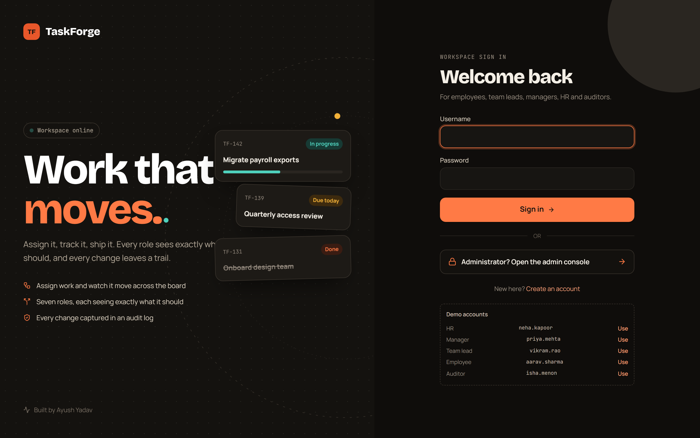
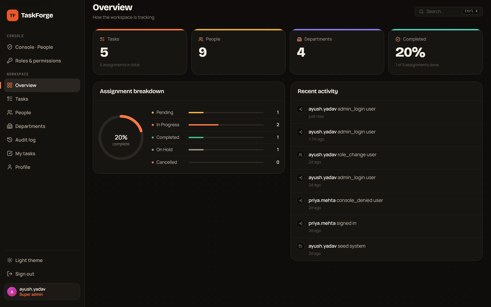
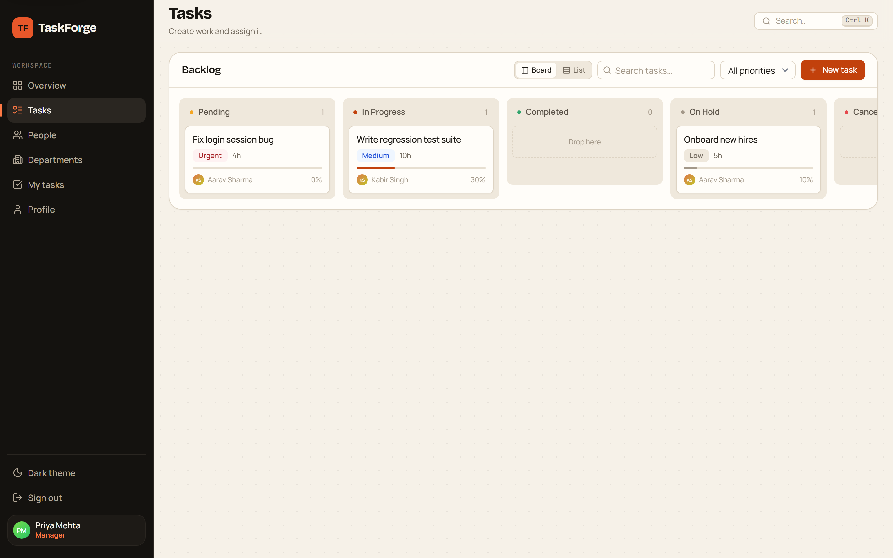
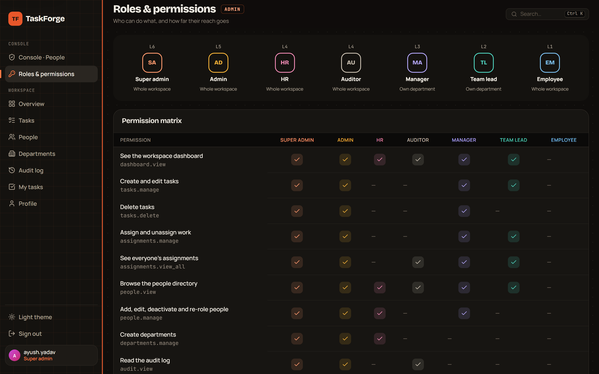
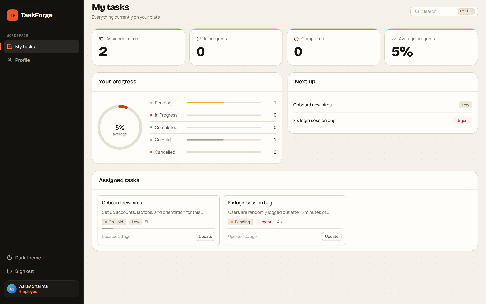
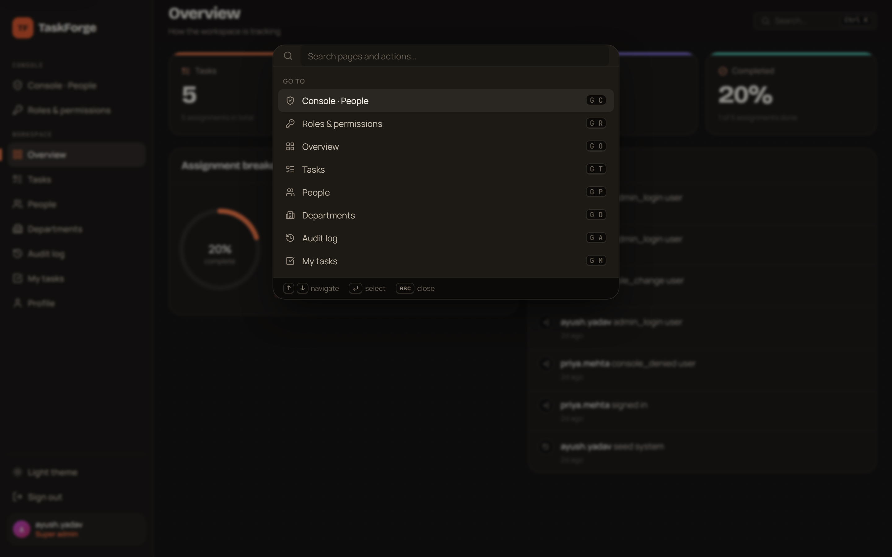
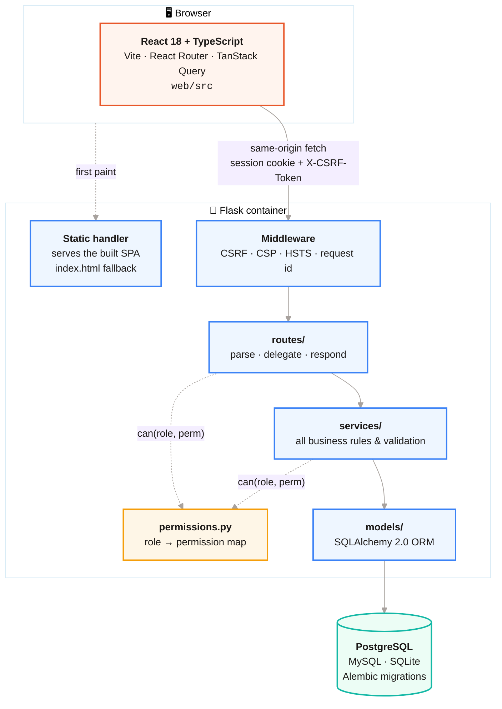
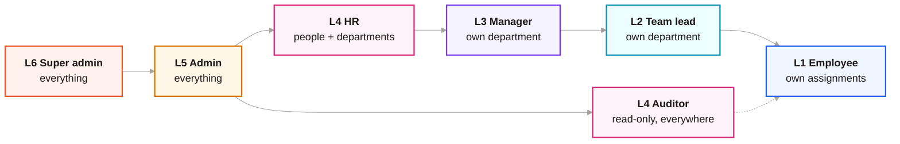
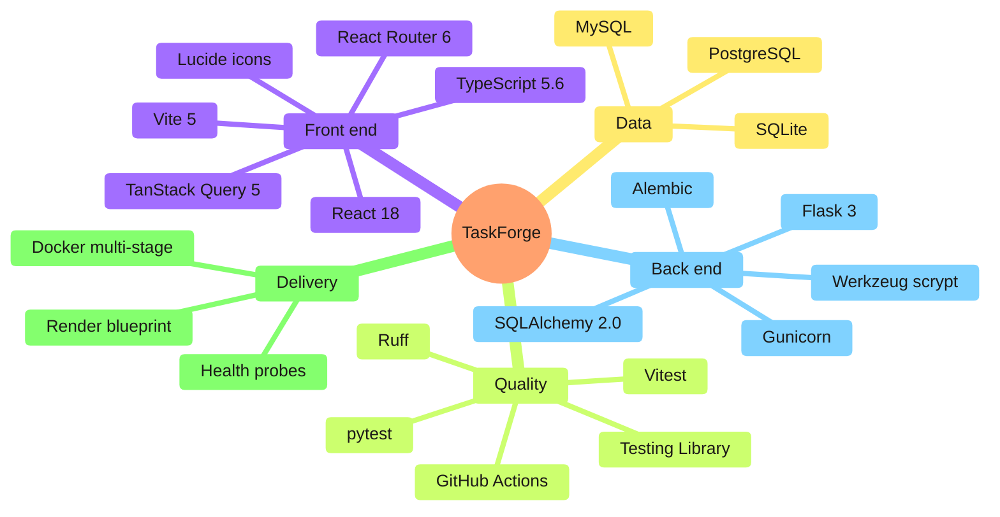

<div align="center">



# TaskForge

### Role-based task & workforce management, built end to end.

**React 18 + TypeScript** SPA · **Flask + SQLAlchemy 2** REST API · **PostgreSQL / MySQL / SQLite** · one Docker image

[](https://github.com/ayushYadav1107/TaskForge/actions/workflows/ci.yml)
[](#-tests)
[](https://python.org)
[](https://react.dev)
[](https://typescriptlang.org)
[](https://flask.palletsprojects.com)
[](https://docker.com)
[](LICENSE)

</div>

---

> Admins and managers create work and assign it. Employees track and update only
> their own. Managers and team leads see only their department. Auditors read
> everything and change nothing. Every mutation is written to an append-only
> audit log with full before/after state.

<br>

<table>
<tr>
<td width="33%" valign="top">

### 🔐 Seven real roles
Super admin, admin, HR, manager, team lead, employee, auditor — defined once in
a single permission map, enforced on every endpoint, never in the browser.

</td>
<td width="33%" valign="top">

### 📋 Board & list
Kanban across five statuses with drag-to-move, plus a sortable table view,
search, priority filters and pagination.

</td>
<td width="33%" valign="top">

### 🧾 Append-only audit
Every create, update, delete and role change lands in `activity_logs` with the
full JSON before/after state.

</td>
</tr>
<tr>
<td valign="top">

### ⌨️ Command palette
<kbd>Ctrl</kbd>/<kbd>Cmd</kbd>+<kbd>K</kbd> with subsequence matching, plus
`g`-then-key chords (`g` `t` → Tasks).

</td>
<td valign="top">

### 🌓 Light & dark
One design-token layer drives both themes, spacing and the whole type scale —
no ad-hoc values anywhere.

</td>
<td valign="top">

### 🐳 One image
Node builds the SPA, a slim Python image serves it and the API behind Gunicorn.
Same origin, so no CORS and no token in `localStorage`.

</td>
</tr>
</table>

---

## 📚 Documentation

The detail lives in focused documents — this page is the tour.

| Document | What's inside |
|---|---|
| 🏛 **[Architecture](docs/ARCHITECTURE.md)** | Layering, request lifecycle, ER diagram, module map, the N+1 fixes |
| 🛡 **[Security & RBAC](docs/SECURITY.md)** | Session design, CSRF, lockout, the full permission matrix, escalation rules |
| 🔌 **[API reference](docs/API.md)** | Every endpoint, its permission, its payload |
| 🧰 **[Development](docs/DEVELOPMENT.md)** | Local setup, MySQL/Postgres, tests, project layout, conventions |
| 🖼 **[Screenshots](docs/SCREENSHOTS.md)** | Every screen, light and dark, desktop and mobile |
| 🚀 **[Deployment](DEPLOYMENT.md)** | Docker, Render, Railway, Fly.io, environment variables |

---

## 🖼 A look around

<div align="center">

**Workspace overview** — live counts, assignment breakdown, recent activity



<br><br>

**Task board** — five statuses, drag to move, priority and progress on every card



<br><br>

**Roles & permissions** — the server's permission map, rendered



<br><br>

<table>
<tr>
<td width="50%"><br><div align="center"><sub><b>My tasks</b> — what an employee sees</sub></div></td>
<td width="50%"><br><div align="center"><sub><b>Command palette</b> — Ctrl/Cmd + K</sub></div></td>
</tr>
</table>

[**→ See every screen**](docs/SCREENSHOTS.md)

</div>

---

## 🏗 How it fits together



**One origin.** In production Flask serves the compiled Vite bundle itself. That
keeps the session cookie first-party — which means no CORS configuration, and no
access token sitting in `localStorage` for an XSS payload to steal.

**Strict layering.** A route handler parses the request, calls a service, and
shapes the response — nothing else. Every business rule lives in `services/`,
which is why the same validation applies whether a task arrives through the API,
the seed script, or the CLI.

[**→ Full architecture, with the request lifecycle and the ER diagram**](docs/ARCHITECTURE.md)

---

## 🔐 Who can do what



Roles are **ranked**. You can only grant a role below your own, and only touch
accounts below your own — so nobody can mint a peer or a superior. Managers and
team leads are **department-scoped**. Super admins and admins come through a
separate door (`/admin/login`) with a 30-minute idle timeout.

Authorization is enforced **server-side on every endpoint**. The React route
guards exist for UX only — anything decided in the browser can be edited in the
browser, so `backend/tests/test_authorization.py` asserts the real rules.

[**→ The full matrix, and how the session is built**](docs/SECURITY.md)

---

## ⚡ Run it locally

**Requirements:** Python 3.11+, Node 20+. No database server needed — it falls
back to SQLite.

```bash
git clone https://github.com/ayushYadav1107/TaskForge.git
cd TaskForge
```

<table>
<tr><td width="50%" valign="top">

**API** — terminal 1

```bash
cd backend
python -m venv venv
venv/Scripts/activate        # macOS/Linux: source venv/bin/activate
pip install -r requirements-dev.txt
cp .env.example .env
flask --app task_management seed
python run.py                # :5000
```

</td><td width="50%" valign="top">

**Front end** — terminal 2

```bash
cd web
npm install
npm run dev                  # :5173
```

Vite proxies `/api` to port 5000, so the
cookie stays first-party in dev exactly
as it is in production.

</td></tr>
</table>

### 🔑 Demo logins

Created by `flask seed`:

| | Role | Username | Password | Door |
|:-:|---|---|---|---|
| 🟠 | Super admin | `ayush.yadav` | `Ayush@123` | `/admin/login` |
| 🟡 | Admin | `meera.nair` | `Admin@123` | `/admin/login` |
| 🩷 | HR | `neha.kapoor` | `Hr@12345` | `/login` |
| 🟣 | Manager · Engineering | `priya.mehta` | `Manager@123` | `/login` |
| 🔵 | Team lead · Engineering | `vikram.rao` | `Lead@1234` | `/login` |
| ⚪ | Auditor | `isha.menon` | `Audit@123` | `/login` |
| 🟢 | Employee | `aarav.sharma` | `Employee@123` | `/login` |

Build with `VITE_DEMO_MODE=true` to show these on the sign-in page. A real deploy
mints a random admin password on first boot instead.

[**→ MySQL/Postgres setup, scripts and conventions**](docs/DEVELOPMENT.md)

---

## 🧪 Tests

**116 tests.** No database server, no browser.

```bash
cd backend && pytest -q      #  89 — auth, RBAC, CSRF, tasks, roles, deploy config
cd web && npm run test       #  27 — API client, session query, formatting
```

The backend suite runs on in-memory SQLite with a fresh schema per test. The most
load-bearing file is `test_authorization.py`: it pins every rule in the permission
matrix, including the ones that were originally wrong.

`test_config.py` is worth a look too — it pins the database-URL normalisation that
decides whether a deploy boots at all. Managed hosts hand out `postgres://`, which
SQLAlchemy 2 rejects outright, and that failure cannot be reproduced locally
against SQLite.

---

## 🧱 Stack



---

## 🧠 Engineering notes

<details>
<summary><b>Authorization was the real bug</b></summary>
<br>

The first version guarded task and assignment endpoints with *"is logged in"*
rather than *"is allowed"*, so any employee could delete tasks and edit other
people's progress. Fixing it meant separating authentication from authorization
and writing the tests that prove the difference.

</details>

<details>
<summary><b>N+1 queries in the list and the dashboard</b></summary>
<br>

The task list issued one `COUNT` per task, and the dashboard loaded every
assignment row into Python to tally statuses. Both are now a single `GROUP BY`.

</details>

<details>
<summary><b>Naive UTC timestamps</b></summary>
<br>

The API serialised `datetime.utcnow()` with no zone marker, so the browser read
every timestamp as local time and labelled everything "just now". Pinned in
`format.test.ts`.

</details>

<details>
<summary><b>Logout raced its own redirect</b></summary>
<br>

Clearing the query cache left the auth query pending, so the route guard read the
last known user for one render and bounced straight back to the dashboard.
Signed-out is now modelled as data (`null`), not as an absent value.

</details>

<details>
<summary><b>Why not JWT?</b></summary>
<br>

Same-origin SPA, so a cookie is strictly better: `HttpOnly` means a script cannot
read it, and revocation is immediate. A token in `localStorage` buys nothing here
and is readable by any injected script.

</details>

<details>
<summary><b>Why the role is re-read every request</b></summary>
<br>

Caching the role in the session means a demotion takes effect whenever the cookie
happens to expire. Re-reading it from the database on each request costs one
indexed lookup and makes the demotion bind immediately.

</details>

---

<div align="center">

Built by **Ayush Yadav** · [MIT](LICENSE)

</div>
