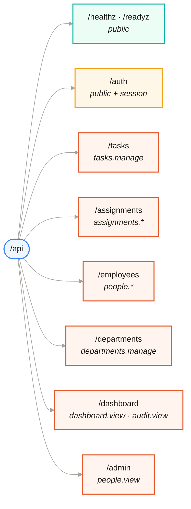

<div align="center">

# 🔌 API reference

**[← Back to README](../README.md)** · [Architecture](ARCHITECTURE.md) · [Security](SECURITY.md) · [Development](DEVELOPMENT.md) · [Screenshots](SCREENSHOTS.md) · [Deployment](../DEPLOYMENT.md)

</div>

---

Everything lives under `/api`. Requests and responses are JSON.

**Authentication** is a session cookie, set by `POST /api/auth/login`.
**Every mutation** (`POST`, `PUT`, `DELETE`) on an authenticated session must
echo the `taskforge_csrf` cookie in an `X-CSRF-Token` header.

```bash
# the login call itself needs no CSRF header — there is no session to ride yet
curl -c jar.txt -X POST http://localhost:5000/api/auth/login \
  -H 'Content-Type: application/json' \
  -d '{"username":"priya.mehta","password":"Manager@123"}'

# every later mutation does
TOKEN=$(grep taskforge_csrf jar.txt | awk '{print $7}')
curl -b jar.txt -X POST http://localhost:5000/api/tasks \
  -H 'Content-Type: application/json' -H "X-CSRF-Token: $TOKEN" \
  -d '{"title":"Ship the docs","priority":"High"}'
```

---

## 🗺 Blueprint map



---

## 🔑 Auth — `/api/auth`

| Method | Route | Access | Notes |
|---|---|---|---|
| `POST` | `/register` | public | Always creates a plain `employee`. Requires `username`, `password`, `first_name`, `last_name`, `email`, `phone`, `department_id` |
| `POST` | `/login` | public | Non-console roles only. Sets the session cookie |
| `POST` | `/admin/login` | public | Super admin and admin only. Sets `console` on the session |
| `GET` | `/departments` | public | The signup picker needs it before a session exists |
| `GET` | `/me` | session | Returns the user, their employee profile, their **permission list** and the roles they may grant |
| `POST` | `/logout` | session | Clears the session |
| `POST` | `/change-password` | session | `current_password` + `new_password` |

<details>
<summary><code>GET /api/auth/me</code> — response shape</summary>

```json
{
  "user": {
    "id": 4,
    "username": "priya.mehta",
    "role": "manager",
    "is_active": true,
    "is_locked": false,
    "last_login_at": "2026-09-23T18:32:18.039827",
    "permissions": [
      "assignments.manage", "assignments.view_all", "dashboard.view",
      "people.manage", "people.view", "tasks.delete", "tasks.manage"
    ],
    "grantable_roles": ["team_lead", "employee"],
    "employee": {
      "id": 7,
      "employee_code": "ENG-020",
      "first_name": "Priya",
      "last_name": "Mehta",
      "email": "priya.mehta@taskforge.dev",
      "position": "Engineering Manager",
      "department_id": 1,
      "department_name": "Engineering",
      "is_active": true
    }
  }
}
```

The SPA hides whatever is not in `permissions`. The server refuses it regardless —
see [Security](SECURITY.md#-where-the-check-actually-lives).

</details>

<details>
<summary>Login failure codes</summary>

| Status | Meaning |
|---|---|
| `401` | `Invalid username or password` — the same message for a missing user, a wrong password and a deactivated account |
| `429` | `Too many failed attempts. Try again in about N minute(s).` |
| `403` | Wrong door: an admin at `/login`, or a non-admin at `/admin/login` |

</details>

---

## 📋 Tasks — `/api/tasks`

| Method | Route | Access |
|---|---|---|
| `GET` | `/tasks` | any session |
| `GET` | `/tasks/<id>` | any session |
| `POST` | `/tasks` | `tasks.manage` |
| `PUT` | `/tasks/<id>` | `tasks.manage` |
| `DELETE` | `/tasks/<id>` | `tasks.delete` — soft delete |

**Query parameters on `GET /tasks`:**

| Param | Type | Default | Notes |
|---|---|---|---|
| `search` | string | — | Matches title and description |
| `priority` | `Low` · `Medium` · `High` · `Urgent` | — | |
| `status` | assignment status | — | Tasks having at least one assignment in that status |
| `created_by` | int | — | User id |
| `page` | int | `1` | |
| `per_page` | int | `100` | Capped at **200** |

Response: `{ "tasks": [...], "page": 1, "per_page": 100, "total": 42 }`.
Each task carries its assignment count — one `GROUP BY`, not one `COUNT` per row.

---

## 🧷 Assignments — `/api/assignments`

| Method | Route | Access |
|---|---|---|
| `GET` | `/assignments` | `assignments.view_all` — department-scoped for managers and team leads |
| `GET` | `/assignments/mine` | any session |
| `GET` | `/assignments/task/<task_id>` | `assignments.view_all`, in scope |
| `GET` | `/assignments/employee/<employee_id>` | `assignments.view_all` in scope, **or** yourself |
| `POST` | `/assignments` | `assignments.manage`, target in scope |
| `PUT` | `/assignments/<id>/status` | the **owner**, or `assignments.manage` in scope |
| `DELETE` | `/assignments/<id>` | `assignments.manage`, in scope |

Statuses: `Pending` · `In Progress` · `Completed` · `On Hold` · `Cancelled`.
`completion_percentage` is `0–100`.

> `PUT /assignments/<id>/status` is the one mutation every role can reach — but
> only for a row they own. That distinction (permission vs. *this particular
> row*) is where the original version of this app was wrong.

---

## 👤 People — `/api/employees`

| Method | Route | Access |
|---|---|---|
| `GET` | `/employees` | `people.view`, department-scoped |
| `GET` | `/employees/department/<id>` | `people.view`, in scope |
| `GET` | `/employees/<id>` | `people.view` in scope, **or** yourself |
| `POST` | `/employees` | `people.manage`, may only create roles below your own |
| `PUT` | `/employees/<id>` | `people.manage`, must outrank the target, in scope |
| `PUT` | `/employees/<id>/role` | `people.manage`, must outrank both the target **and** the new role |
| `POST` | `/employees/<id>/unlock` | `people.manage`, must outrank the target |
| `DELETE` | `/employees/<id>` | `people.manage`, must outrank the target — deactivates |

---

## 🏢 Departments — `/api/departments`

| Method | Route | Access |
|---|---|---|
| `GET` | `/departments` | any session |
| `POST` | `/departments` | `departments.manage` |

---

## 📊 Dashboard — `/api/dashboard`

| Method | Route | Access |
|---|---|---|
| `GET` | `/dashboard/stats` | `dashboard.view` |
| `GET` | `/dashboard/activity` | `audit.view` — `?limit=` default 50, capped at 200 |

<details>
<summary><code>GET /api/dashboard/stats</code> — response shape</summary>

```json
{
  "stats": {
    "total_tasks": 5,
    "total_employees": 9,
    "total_departments": 4,
    "total_assignments": 5,
    "completion_rate": 20,
    "by_status": {
      "Pending": 1, "In Progress": 2, "Completed": 1,
      "On Hold": 1, "Cancelled": 0
    }
  },
  "recent_activity": [ /* 10 most recent audit rows */ ]
}
```

`by_status` is one `GROUP BY` — the first version loaded every assignment row
into Python to tally it.

</details>

---

## ⚙️ Admin — `/api/admin`

| Method | Route | Access |
|---|---|---|
| `GET` | `/admin/roles` | `people.view` — the whole role/permission map, shaped for the roles screen |

---

## ❤️ Health — `/api`

| Method | Route | Purpose |
|---|---|---|
| `GET` | `/healthz` | **Liveness.** Touches nothing, so it answers even when the database is down. Point platform health checks here |
| `GET` | `/readyz` | **Readiness.** Round-trips `SELECT 1`; returns **503** when the database is unreachable |

Gating a platform health check on `/readyz` would make the host kill and restart
the container during a database blip — turning a brief outage into a restart loop.

---

## 🚨 Errors

Every error is `{"error": "<message>"}` with a matching status.

| Status | When |
|---|---|
| `400` | Validation failed, or a uniqueness conflict — the message names the field |
| `401` | No session, or the session is no longer valid |
| `403` | Authenticated but not allowed — including a CSRF mismatch and a wrong-door login |
| `404` | No such row, or one outside your department scope |
| `429` | Account locked after too many failed logins |
| `500` | Generic message only. The traceback goes to the log, keyed by the `X-Request-ID` on the response |

---

<div align="center">

**[← Security](SECURITY.md)** · **[Development →](DEVELOPMENT.md)**

</div>
