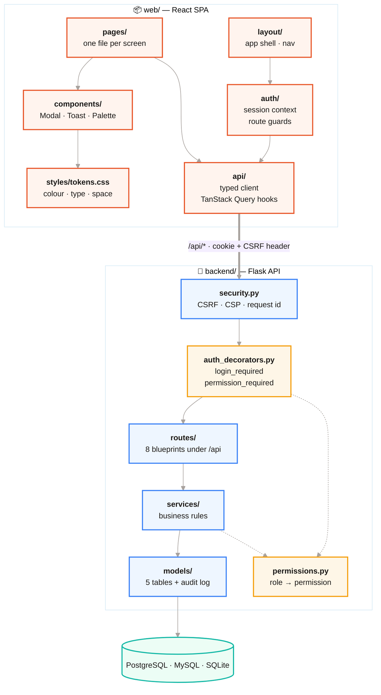
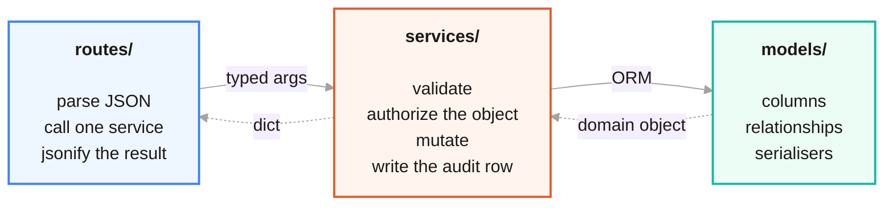
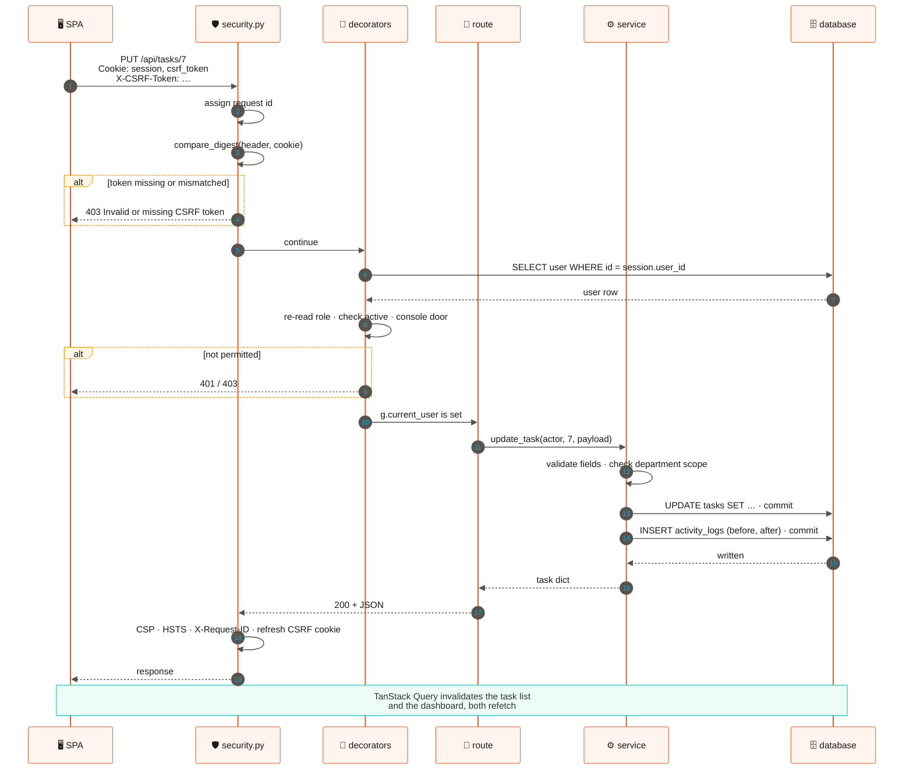
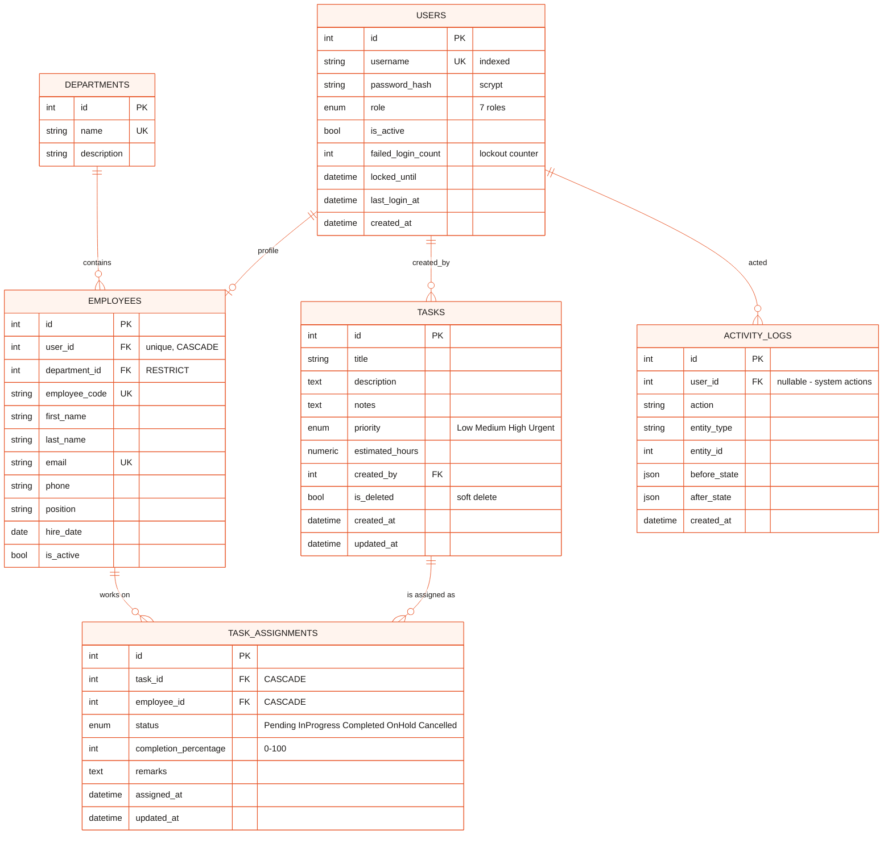
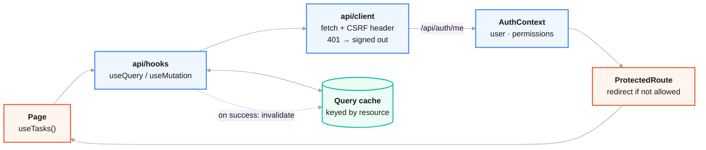

<div align="center">

# 🏛 Architecture

**[← Back to README](../README.md)** · [Security](SECURITY.md) · [API](API.md) · [Development](DEVELOPMENT.md) · [Screenshots](SCREENSHOTS.md) · [Deployment](../DEPLOYMENT.md)

</div>

---

## The shape of it

One repository, two halves, one deployed container.



### Why one origin

In production Flask serves the compiled Vite bundle itself, with an
`index.html` fallback so client-side routes survive a hard refresh or a shared
deep link. The SPA and the API therefore share an origin, which buys three
things:

- the session cookie is **first-party**, so no CORS configuration exists to get wrong,
- there is **no access token in `localStorage`** for an injected script to read,
- dev matches prod — Vite proxies `/api` to port 5000 rather than pointing at a
  different host.

---

## Layering rule

> A route handler parses the request, calls a service, and shapes the response.
> Nothing else.

Every business rule lives in `services/`. That is why the same validation
applies whether a task arrives through the API, the seed script, or the Flask
CLI — there is exactly one code path that can create one.



`services/errors.py` defines the domain errors. A service raises one; the error
handler turns it into a status code. No route builds an error response by hand,
so the API answers consistently no matter which endpoint failed.

---

## Request lifecycle

What actually happens between a click and a row changing.



Two details worth calling out:

- **The role is re-read from the database on every request.** Caching it in the
  session means a demotion takes effect whenever the cookie happens to expire.
  One indexed lookup makes it bind immediately.
- **The audit row is written by the service, not the route.** `services/` owns
  the `log(actor, action, entity, before, after)` call, so a mutation reached
  through the seed script or the CLI is logged exactly like one that came over
  HTTP. The log is a straight append — nothing updates or deletes a row in
  `activity_logs`.

---

## Data model



**Design choices in that diagram:**

| Choice | Why |
|---|---|
| `users` and `employees` are separate tables | A login is not a person. The seed's system actor and a bootstrap admin have no employee profile, and deactivating a login should not delete an HR record. |
| `department_id` is `RESTRICT`, not `CASCADE` | Deleting a department must not silently take its people with it. |
| `tasks.is_deleted` is a soft delete | The audit log references task ids. A hard delete would leave dangling history. |
| Status lives on the **assignment**, not the task | Two people on one task can be at different stages; the task's own progress is derived. |
| `before_state` / `after_state` are JSON | The log survives schema changes — it records what the row looked like, not a foreign key into a shape that may no longer exist. |

---

## Module map

```
backend/
  task_management/
    __init__.py          app factory, SPA handler, error handlers, first-boot bootstrap
    config.py            env-driven; normalises postgres:// and mysql:// URLs
    extensions.py        db, migrate — importable without circular imports
    permissions.py       ROLES, LEVEL, PERMISSIONS — the single source of truth
    auth_decorators.py   login_required, permission_required, department scoping
    security.py          CSRF, response headers, request id, request log
    seed.py              demo data, idempotent
    models/              user · employee · department · task · task_assignment · activity_log
    routes/              health · auth · task · employee · department · assignment · dashboard · admin
    services/            auth · task · assignment · employee · activity · passwords · errors
  migrations/            Alembic — the source of truth for schema
  tests/                 auth · authorization · config · roles · security · tasks
  gunicorn.conf.py       worker count, timeouts, access log format

web/
  src/
    api/                 typed fetch client + TanStack Query hooks (and their tests)
    auth/                AuthContext, ProtectedRoute, PublicOnlyRoute
    components/          Modal, Toast, ConfirmDialog, CommandPalette, primitives
    layout/              AppShell — the single source of truth for navigation
    pages/               Overview, Tasks, MyTasks, Employees, Departments, Activity,
                         Profile, Login, AdminLogin, AdminPeople, AdminRoles, Signup
    styles/              tokens.css, base.css, components.css, lively.css
    lib/                 formatting helpers (and their tests)
    theme.tsx            light/dark, persisted, honours prefers-color-scheme

database/schema.sql      the original hand-written MySQL schema, kept for reference
Dockerfile               two-stage: Node builds, Python serves
render.yaml              one-click Render blueprint
railway.toml             Railway build + health check config
docker-compose.yml       local Postgres for development
```

---

## Front-end data flow



Server state lives in TanStack Query and nowhere else — there is no Redux store
mirroring rows the server already owns. A mutation invalidates the keys it
affected and the affected screens refetch.

**Signed-out is modelled as data.** `/api/auth/me` resolving to `null` is a
successful answer, not a missing one. Modelling it as *absent* is what made
logout race its own redirect: the guard read the last known user for one render
and bounced straight back to the dashboard.

**Permissions come from the server.** `/api/auth/me` returns the user's own
permission list, and the UI hides what the server would refuse anyway. The guards
are UX, not security — [Security](SECURITY.md) covers where the real check lives.

---

## Performance notes

| Problem | Fix |
|---|---|
| Task list ran one `COUNT` per task to show assignment counts | One `GROUP BY` joined into the list query |
| Dashboard loaded every assignment row into Python to tally statuses | One `GROUP BY status` aggregate |
| Session user re-queried by each decorator in the chain | `login_required` resolves it once and parks it on `g` |
| Font files fetched from a CDN on first paint | Self-hosted through `@fontsource-variable`, so the strict CSP needs no `font-src` exception and there is no third-party request |

---

<div align="center">

**[← README](../README.md)** · **[Security & RBAC →](SECURITY.md)**

</div>
