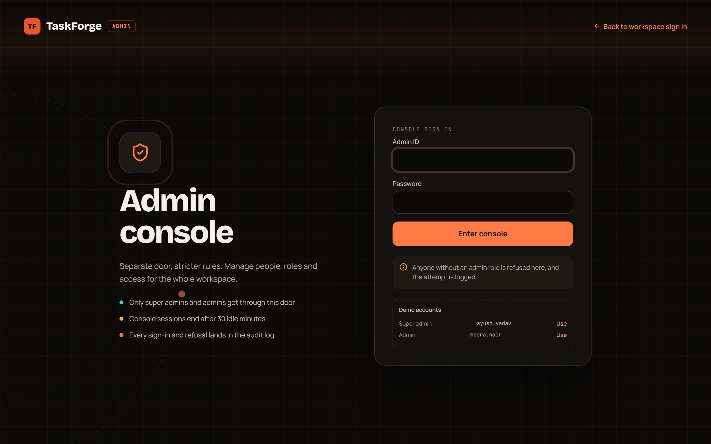
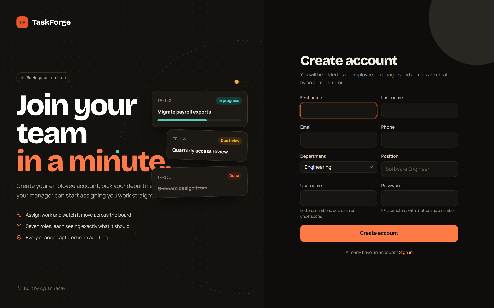
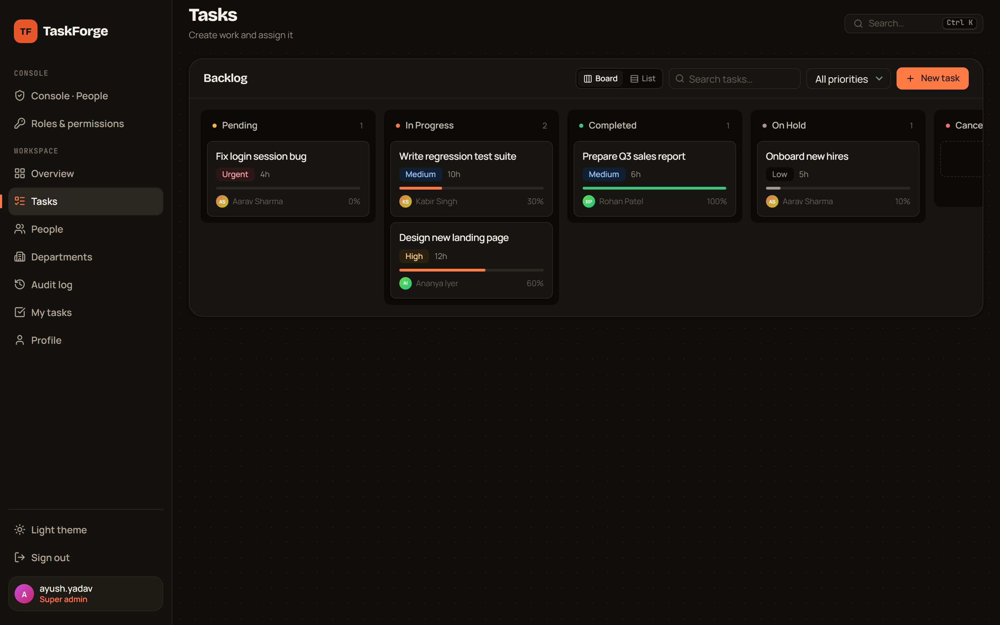
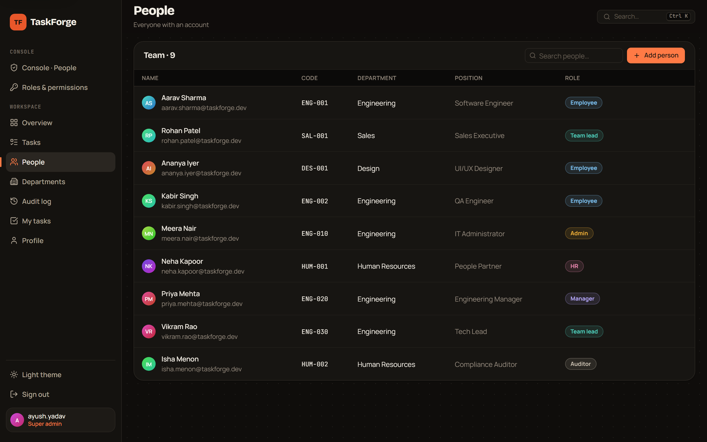
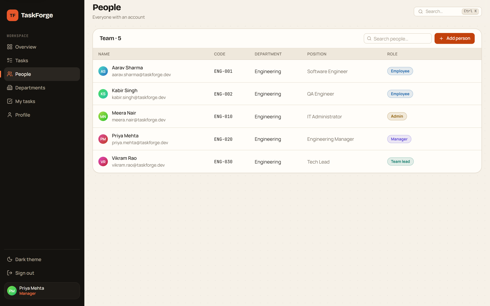
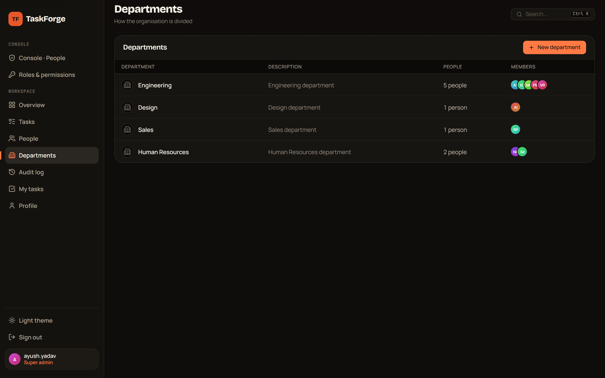
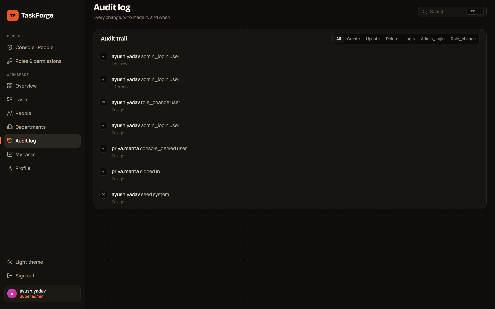
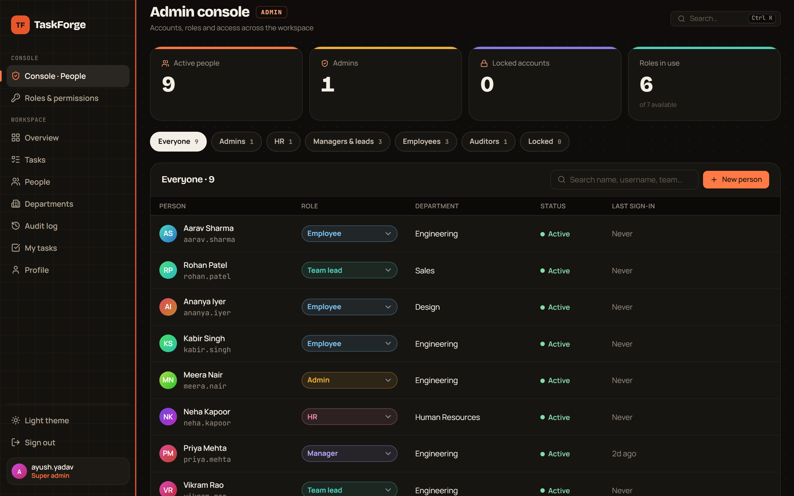
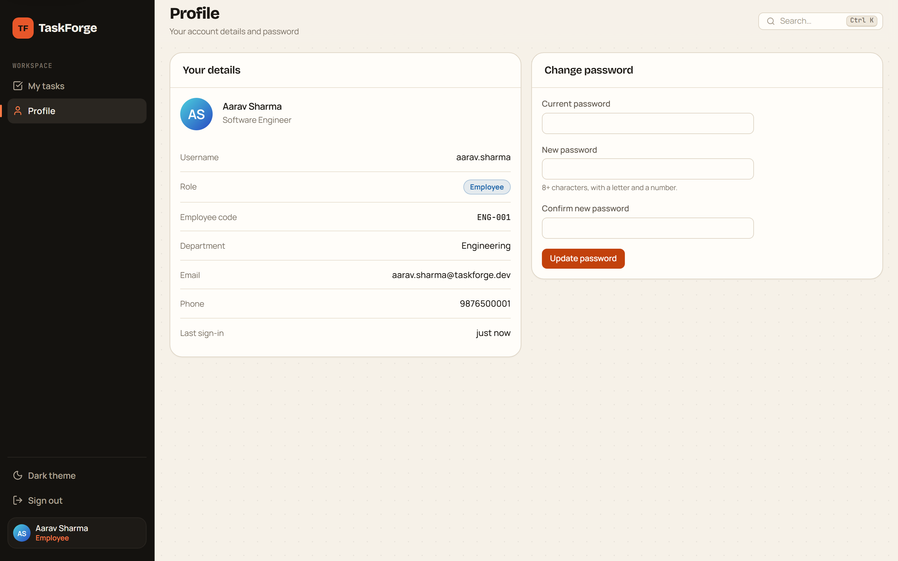
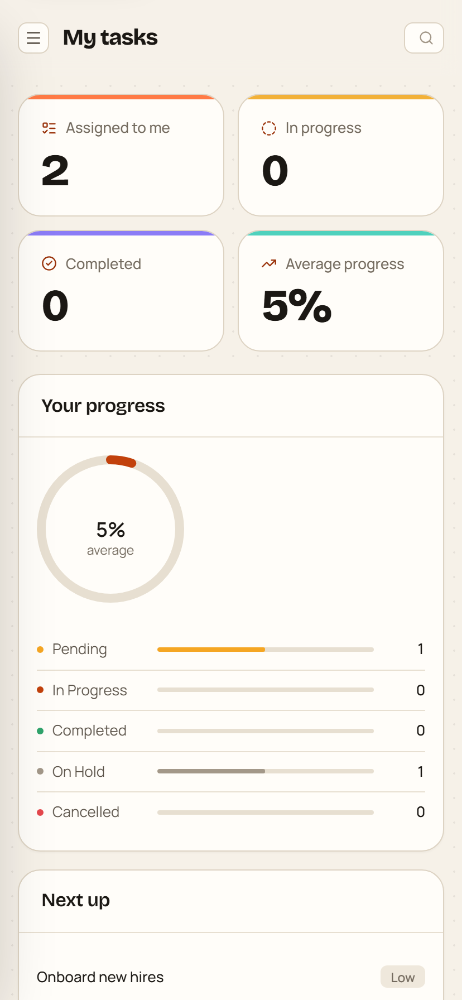

# 🖼 Screenshots

**[← Back to README](../README.md)** · [Architecture](ARCHITECTURE.md) · [Security](SECURITY.md) · [API](API.md) · [Development](DEVELOPMENT.md) · [Deployment](../DEPLOYMENT.md)

---

Every screen below is the real app, captured against seeded data. Roles see
different navigation and different screens — that is the point, so each shot
says who is signed in.

---

## 🔐 Sign in

 <b>/login</b> — the workspace door. Employees, team leads, managers, HR and auditors. The demo account list only appears when the bundle is built with <code>VITE_DEMO_MODE=true</code>.

 

 <b>/admin/login</b> — the console door. Super admins and admins sign in only here, and their session carries a flag that ordinary sign-ins never get.

 

 <b>/signup</b> — self-registration always creates a plain <code>employee</code>. The department picker is fed by a public endpoint, because there is no session yet.

---

## 📊 Workspace

 <b>/overview</b> · super admin · dark — counts, the assignment breakdown (one <code>GROUP BY</code>) and the ten most recent audit entries.

 

 <b>/tasks</b> · super admin · dark — five status columns, drag a card to move it.

 

 <b>/tasks</b> · manager · light — the same screen, the other theme. Board or list, search, priority filter, and progress on every card.

 

 <b>/employees</b> · super admin · dark — the whole organisation.

 

 <b>/employees</b> · manager · light — <b>the same route, fewer rows.</b> A manager is
department-scoped, and the filtering happens on the server, not in the browser.

 

 <b>/departments</b> · super admin · dark — headcount and member avatars per department. Creating one needs <code>departments.manage</code> — super admin, admin or HR.

---

## 🧾 Audit

 <b>/activity</b> · super admin · dark — append-only, newest first, filterable by action type. Each row names the actor, the action and the entity; the stored row also carries the full JSON before/after state. Readable by super admin, admin and auditor.

---

## 🛡 Admin console

 <b>/admin</b> · super admin · dark — active people, admins, locked accounts and roles in use, with a filter chip per cohort. Re-role inline, add, deactivate or unlock. The role dropdown only ever offers roles ranked below your own.

 

 <b>/admin/roles</b> — the server's permission map, rendered. Seven roles, their rank, their scope, and every permission each one holds. Nothing here is hardcoded in the UI: it is <code>GET /api/admin/roles</code>, which reads <code>permissions.py</code>.

---

## 👤 Employee view

 <b>/my-tasks</b> · employee — two nav items, and only their own work. Updating status is the one mutation every role can reach, and only on a row they own.

 

 <b>/profile</b> · employee · light — own details and password change. The one screen every role can reach.

---

## ⌨️ Command palette

 <kbd>Ctrl</kbd>/<kbd>Cmd</kbd>+<kbd>K</kbd> — subsequence matching, arrow keys to navigate, <kbd>Esc</kbd> to close. Each row shows its <code>g</code>-chord: <code>g</code> <code>t</code> for Tasks, <code>g</code> <code>a</code> for the audit log. The list is built from the same navigation source the sidebar uses, so it can never drift.

---

## 📱 Mobile

 <b>/my-tasks</b> at 414px — the stat row reflows to a 2×2 grid, the panels stack, and the sidebar collapses behind a drawer toggle.

---

## 🌓 Both themes

Light and dark are not two stylesheets. `web/src/styles/tokens.css` defines one
set of semantic tokens — surface, border, text, accent, status — and redefines
their values under `[data-theme="dark"]`. Components reference the token, never
a hex value, so a new screen gets both themes for free.

The choice is persisted, and defaults to the operating system's
`prefers-color-scheme` on a first visit.

---

**[← Development](DEVELOPMENT.md)** · **[Deployment →](../DEPLOYMENT.md)**

