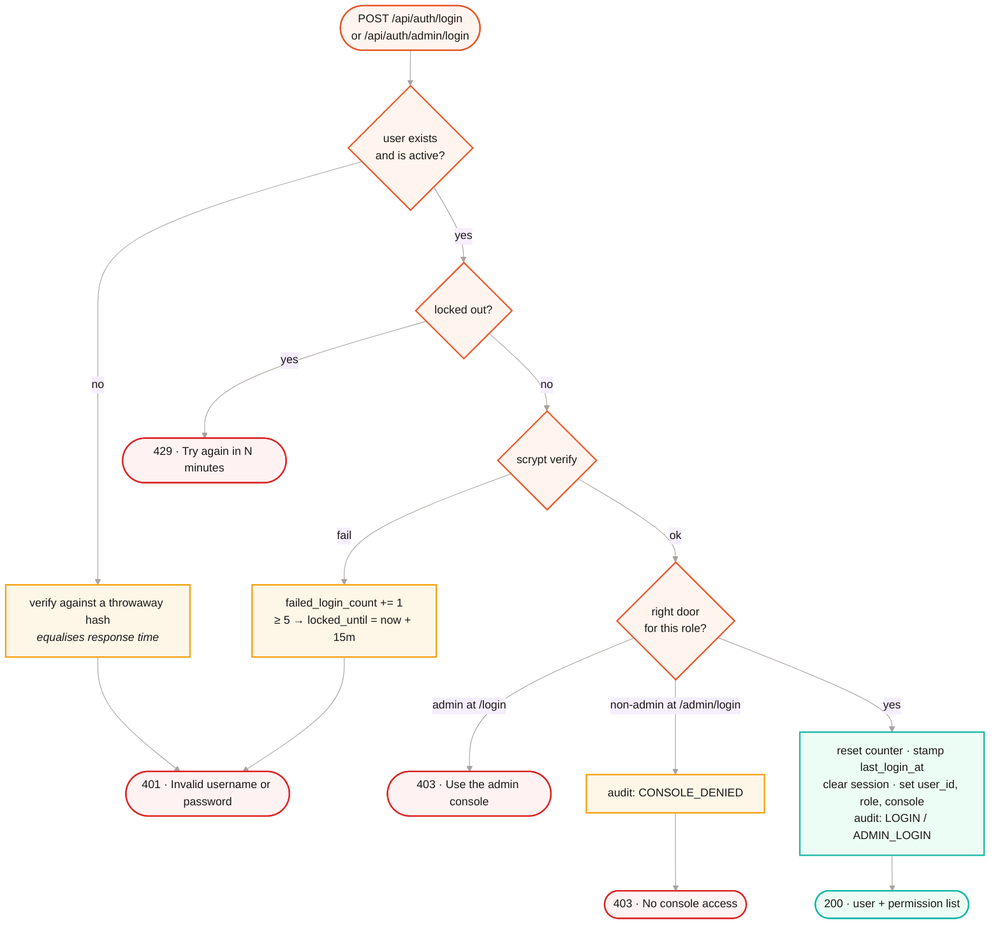
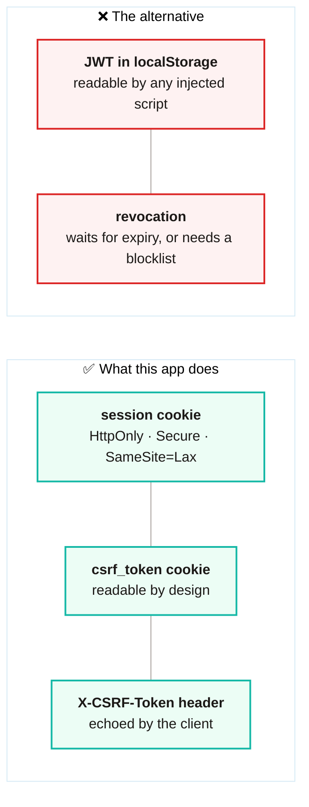
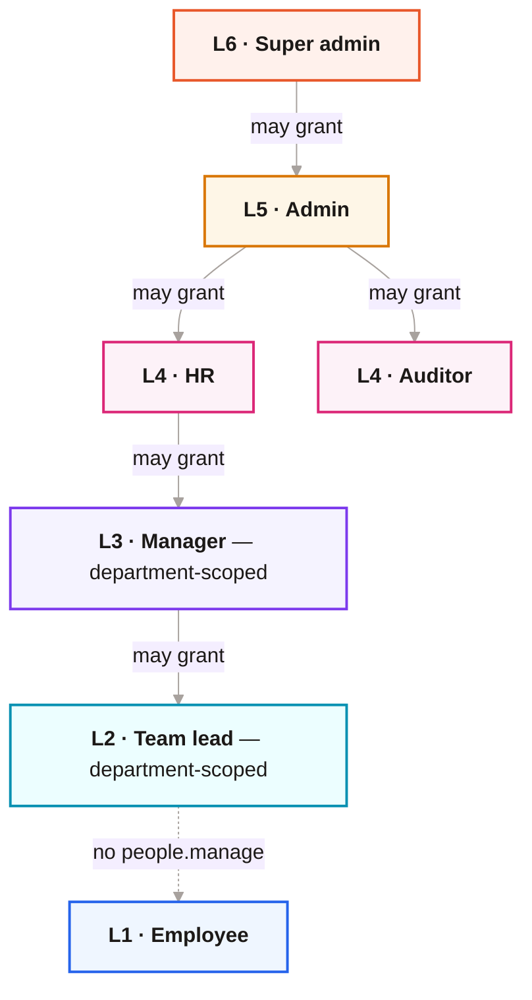
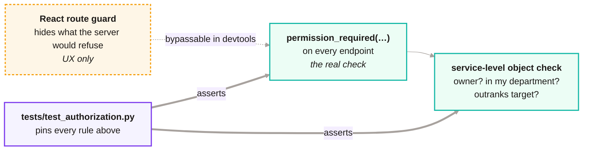

<div align="center">

# 🛡 Security & RBAC

**[← Back to README](../README.md)** · [Architecture](ARCHITECTURE.md) · [API](API.md) · [Development](DEVELOPMENT.md) · [Screenshots](SCREENSHOTS.md) · [Deployment](../DEPLOYMENT.md)

</div>

---

> Cookie sessions are the right fit for a same-origin SPA, but they have to be
> built correctly. This page is what that meant here.

---

## 🔒 The threat list

| Concern | Approach |
|---|---|
| **Password storage** | `scrypt` via Werkzeug — memory-hard, so GPU cracking is expensive |
| **Brute force** | Lockout after 5 failures for 15 minutes, counted **on the user row** so the limit is shared across every worker and survives a restart |
| **Username enumeration** | One generic error for every credential failure, plus a dummy hash verification on the miss path so a nonexistent user doesn't answer measurably faster |
| **CSRF** | Double-submit token: a readable cookie the SPA echoes in `X-CSRF-Token`, compared with `compare_digest`. Enforced only on authenticated mutations, so `curl`-ing the login endpoint still works |
| **Session fixation** | The session is cleared and rebuilt at the login boundary |
| **Stale privileges** | The role is re-read from the database on every request, so a demotion binds immediately instead of waiting for the cookie to expire |
| **Privilege escalation** | Roles are ranked; you may only grant roles, and touch accounts, strictly below your own |
| **XSS** | Strict CSP — `script-src 'self'`, no `unsafe-inline` for scripts, `connect-src 'self'`, `frame-ancestors 'none'` — plus React's escaping by default |
| **Clickjacking** | `X-Frame-Options: DENY` |
| **MIME sniffing** | `X-Content-Type-Options: nosniff` |
| **Transport** | `Secure` + `HttpOnly` + `SameSite=Lax` cookies, and HSTS in production |
| **Secrets** | Production **refuses to boot** without `SECRET_KEY` rather than falling back to a shared default |
| **Error leakage** | Unhandled exceptions return a generic message; the traceback goes to the log with a correlation id |
| **Third-party requests** | Fonts and icons are bundled, so the strict CSP needs no `font-src` exception and first paint makes no outside request |

---

## 🚪 Two doors

Super admins and admins sign in **only** at `/admin/login`; everyone else **only**
at `/login`. The door is checked *after* the password, so it reveals nothing to
someone guessing usernames.



An admin session also ends after `ADMIN_IDLE_MINUTES` (default **30**) of
inactivity, and a user promoted to admin mid-session must sign in again through
the console — admin power only travels on a session that actually passed the
stricter door.

---

## 🍪 Why cookies, not JWT



The SPA and API share an origin, so a cookie is strictly better here: `HttpOnly`
means a script cannot read it, and revocation is immediate. A token in
`localStorage` buys nothing and is readable by any injected script.

The cost of choosing cookies is CSRF, which is why the double-submit token
exists. It is deliberately **not** `HttpOnly` — the client has to read it back
out and echo it in a header, which a cross-site page cannot do.

---

## 👥 Roles

Seven roles, defined once in `backend/task_management/permissions.py`. Routes
check **permissions** (`tasks.manage`, `people.manage`, …), never role names, and
`/api/auth/me` sends each user their own permission list for the UI.

<div align="center">

<br><sub>The screen at <code>/admin/roles</code> renders the same map the server enforces.</sub>
</div>

### The matrix

| Capability | Super admin | Admin | HR | Auditor | Manager | Team lead | Employee |
|---|:---:|:---:|:---:|:---:|:---:|:---:|:---:|
| `console.access` — admin console (separate door) | ✓ | ✓ | | | | | |
| `dashboard.view` — workspace dashboard | ✓ | ✓ | ✓ | ✓ | ✓ | ✓ | |
| `tasks.manage` — create / edit tasks | ✓ | ✓ | | | ✓ | ✓ | |
| `tasks.delete` — delete tasks | ✓ | ✓ | | | ✓ | | |
| `assignments.manage` — assign / unassign | ✓ | ✓ | | | dept | dept | |
| `assignments.view_all` — everyone's assignments | ✓ | ✓ | | ✓ | dept | dept | |
| `people.view` — browse people | ✓ | ✓ | ✓ | ✓ | dept | dept | |
| `people.manage` — add, edit, deactivate, re-role | ✓ | ✓ | ✓ | | dept | | |
| `departments.manage` — create departments | ✓ | ✓ | ✓ | | | | |
| `audit.view` — read the audit log | ✓ | ✓ | | ✓ | | | |
| *(always)* update **own** assignment status | ✓ | ✓ | ✓ | ✓ | ✓ | ✓ | ✓ |

`dept` = the same permission, confined to the actor's own department.

### Rank



Three rules sit on top of the matrix:

1. **No escalation.** You may only grant roles ranked strictly below your own, and
   only modify accounts ranked strictly below your own. Nobody can mint a peer or
   a superior. Auditor sits at rank 4 beside HR — read-everything power is not
   something a manager should be able to hand out.
2. **Department scope.** A manager or team lead sees and acts on people in their
   own department only. A scoped user with no employee profile resolves to a
   department id that matches nothing — never to "all".
3. **Two doors.** Console roles sign in through `/admin/login` and their session
   carries a `console` flag; without it, admin power does not apply.

---

## 🧷 Where the check actually lives



A permission answers *"may this role do this kind of thing?"*. It does not answer
*"to this particular row?"* — that second question is the service's job, and it
is where the original version of this app was wrong. `test_authorization.py`
asserts both halves, including the rules that were originally broken:

- an employee could delete tasks,
- an employee could edit another person's assignment progress,
- a manager could act on people outside their own department.

---

## 🧾 The audit log

Every mutation appends a row to `activity_logs` with the actor, the action, the
entity, and the **full JSON before/after state**. Nothing updates or deletes a
row in that table.

<div align="center">

</div>

Storing the state as JSON rather than as a diff of foreign keys means the log
survives schema changes: it records what the row looked like, not a pointer into
a shape that may no longer exist.

Read access is `audit.view` — super admin, admin and auditor. The auditor role
exists precisely so that "can read everything" and "can change things" are
separable.

---

## 🔐 Security headers

Set on every response by `security.py`:

```http
Content-Security-Policy: default-src 'self'; script-src 'self';
  style-src 'self' 'unsafe-inline'; img-src 'self' data:; font-src 'self';
  connect-src 'self'; frame-ancestors 'none'; base-uri 'self'; form-action 'self'
X-Content-Type-Options: nosniff
X-Frame-Options: DENY
Referrer-Policy: strict-origin-when-cross-origin
Permissions-Policy: geolocation=(), microphone=(), camera=()
Strict-Transport-Security: max-age=31536000; includeSubDomains   # production only
X-Request-ID: <12 hex chars>
```

`X-Request-ID` is echoed back from the request when the caller supplies one, and
generated otherwise. It appears on the response, in every log line for that
request, and in the generic error body — so a user can report *"request
a1b2c3d4e5f6 failed"* and the traceback is one grep away.

---

## ⚙️ Tunables

| Variable | Default | Effect |
|---|---|---|
| `MAX_FAILED_LOGINS` | `5` | Failures before the account locks |
| `LOCKOUT_MINUTES` | `15` | How long the lock holds |
| `MIN_PASSWORD_LENGTH` | `8` | Enforced on register and change-password |
| `ADMIN_IDLE_MINUTES` | `30` | Idle timeout for console sessions |
| `SESSION_LIFETIME_SECONDS` | `43200` | Session cookie lifetime (12 hours) |
| `SECRET_KEY` | — | **Required** in production; the app refuses to boot without it |
| `APP_ENV` | `development` | `production` turns on `Secure` cookies and HSTS |

A locked account can be released by anyone with `people.manage` who outranks it,
via `POST /api/employees/<id>/unlock`.

---

<div align="center">

**[← Architecture](ARCHITECTURE.md)** · **[API reference →](API.md)**

</div>
